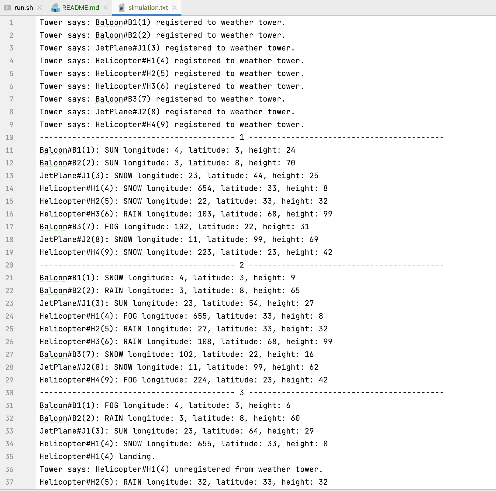

# 🚁 Java simulator
To get familiar with classic OOP design-patterns: `Observer`, `Singleton`, `Factory`

## 🏃🏽‍♀ ️Compile and run
```
find . -name "*.java" > src.txt
javac -sourcepath . @src.txt
java com.mkristie.avajlauncher.Main scenario.txt
```
clean
```
find . -name "*.class" -delete && rm -f src.txt
```
full clean
```
find . -name "*.class" -delete && rm -f simulation.txt src.txt
```

## 🔬 Result

